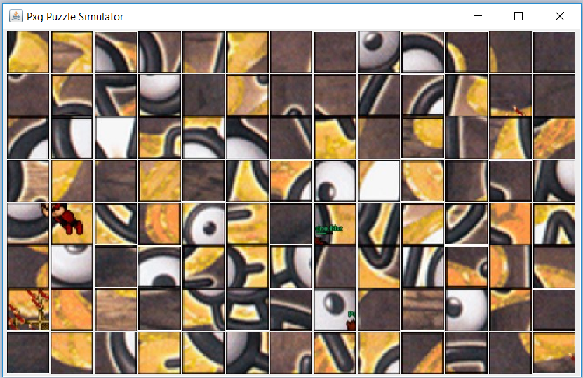

# Pxg Puzzle Challenge Simulator
Simulador do quebra cabeça para praticar na missão dos unowns.

## Requerimentos
O simulador foi desenvolvido em Java e o arquivo está localizado na pasta dist. Para executar o programa é necessário ter instalado a [JVM versão 8+](https://www.java.com/pt_BR/download/win10.jsp).

### Imagem de ilustração

