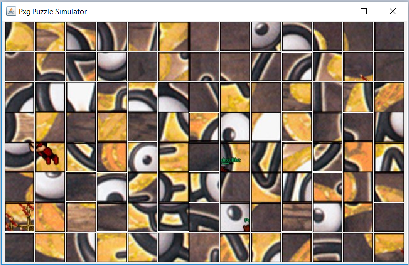

# Pxg Puzzle Challenge Simulator
Simulador do quebra-cabeça para praticar na missão dos unowns.

Obs.: Ao terminar o quebra-cabeça, caso todas as peças estiverem corretas, irá aparecer uma mensagem que o quebra-cabeça foi finalizado.

## Versão online
A versão online do quebra-cabeça foi desenvolvida em Angular 7 e está disponível no link [http://pxg-puzzle-challenge-simulator.herokuapp.com/](http://pxg-puzzle-challenge-simulator.herokuapp.com/).

## Versão offline
A versão offline do quebra-cabeça foi desenvolvida em Java e o arquivo está disponível para [download](https://github.com/Elderjr/pxgPuzzleChallengeSimulator/blob/master/dist/pxgPuzzleSimulator.jar) na pasta dist. Para executar o programa é necessário ter instalado a [JVM versão 8+](https://www.java.com/pt_BR/download/win10.jsp).

### Imagem de ilustração

